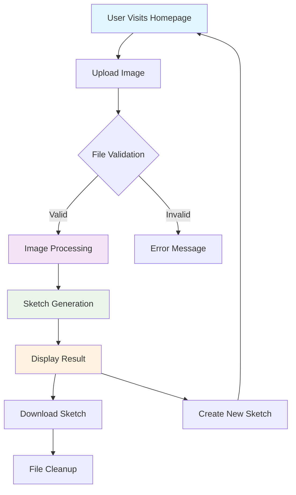
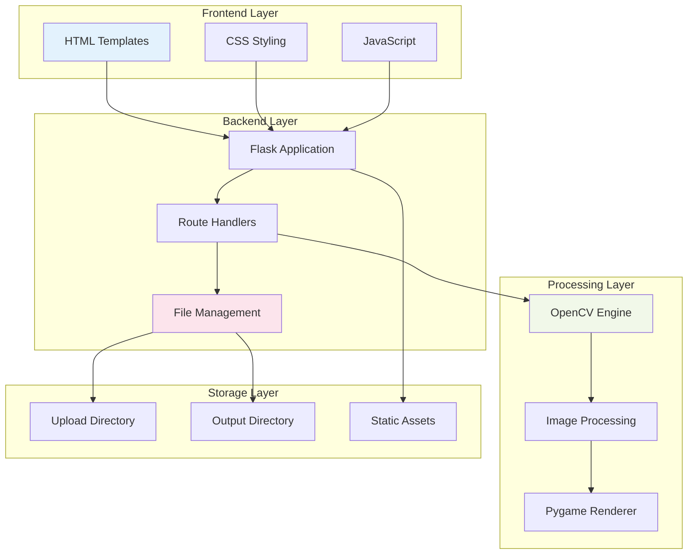

# 🎨 Art Spark - DoodlePic Project

[](https://www.python.org/downloads/)
[](https://flask.palletsprojects.com/)
[](https://opencv.org/)
[](LICENSE)
[](https://www.pygame.org/)

> **Transform your digital images into beautiful artistic sketches with just one click!**

**Art Spark** is a modern web application that converts your photos into stunning pencil sketches using advanced computer vision algorithms. Built with Flask and OpenCV, it provides a seamless, responsive experience across all devices.

🎬 **[Watch Demo Video](https://youtu.be/Ri5vf8UpwGQ)**

---

## 📋 Table of Contents

- [Features](#-features)
- [Demo](#-demo)
- [Architecture](#-architecture)
- [Installation](#-installation)
- [Usage](#-usage)
- [API Documentation](#-api-documentation)
- [Project Structure](#-project-structure)
- [Technologies](#-technologies)
- [Algorithm Details](#-algorithm-details)
- [Performance](#-performance)
- [Contributing](#-contributing)
- [License](#-license)
- [Support](#-support)

---

## ✨ Features

### Core Features

- 🖼️ **Instant Image-to-Sketch Conversion** - Transform any image into a artistic pencil sketch
- 📱 **Fully Responsive Design** - Works seamlessly on desktop, tablet, and mobile devices
- ⚡ **Real-time Processing** - Fast image processing with optimized algorithms
- 🗂️ **Smart File Management** - Automatic cleanup prevents storage accumulation
- 💾 **One-Click Download** - Download your sketches in high quality PNG format

### Advanced Features

- 🔄 **Automatic File Cleanup** - Prevents server storage bloat with intelligent file management
- 🎯 **File Validation** - Supports PNG, JPG, JPEG, GIF formats with size limits
- 🛡️ **Error Handling** - Robust error handling for a smooth user experience
- 🔧 **Background Processing** - Periodic cleanup ensures optimal performance
- 📏 **File Size Limits** - 5MB upload limit for optimal performance

### User Experience

- 🎨 **Modern UI/UX** - Clean, intuitive interface with smooth animations
- 🚀 **Fast Loading** - Optimized assets and efficient processing
- 📱 **Mobile-First Design** - Touch-friendly interface for mobile users
- ♿ **Accessibility** - Built with accessibility best practices

---

## 🎯 Demo

### Live Application Flow



---

## 🏗️ Architecture

### System Architecture



### Data Flow Diagram


---

## 🚀 Installation

### Prerequisites

- **Python 3.8+** - [Download Python](https://www.python.org/downloads/)
- **pip** - Package manager (comes with Python)
- **Git** - [Download Git](https://git-scm.com/downloads)

### Quick Start

1. **Clone the Repository**

   ```bash
   git clone https://github.com/yourusername/DoodlePic-project.git
   cd DoodlePic-project
   ```

2. **Create Virtual Environment** (Recommended)

   ```bash
   # Windows
   python -m venv venv
   venv\Scripts\activate

   # macOS/Linux
   python3 -m venv venv
   source venv/bin/activate
   ```

3. **Install Dependencies**

   ```bash
   pip install -r requirements.txt
   ```

4. **Run the Application**

   ```bash
   python app.py
   ```

5. **Access the Application**
   - Open your browser and navigate to: `http://localhost:5000`
   - Start uploading and converting your images!

### Docker Installation (Alternative)

```dockerfile
# Create Dockerfile
FROM python:3.9-slim

WORKDIR /app
COPY requirements.txt .
RUN pip install -r requirements.txt

COPY . .
EXPOSE 5000

CMD ["python", "app.py"]
```

```bash
# Build and run
docker build -t art-spark .
docker run -p 5000:5000 art-spark
```

---

## 💻 Usage

### Web Interface

1. **Upload Image**

   - Click the upload area or drag & drop your image
   - Supported formats: PNG, JPG, JPEG, GIF
   - Maximum file size: 5MB

2. **Processing**

   - The application automatically processes your image
   - Processing typically takes 2-5 seconds

3. **Download Result**
   - View your generated sketch
   - Click "Download Sketch" to save the result
   - Click "Remake" to process another image

### Supported File Formats

| Format | Extension   | Max Size | Notes                         |
| ------ | ----------- | -------- | ----------------------------- |
| PNG    | .png        | 5MB      | Recommended for best quality  |
| JPEG   | .jpg, .jpeg | 5MB      | Most common format            |
| GIF    | .gif        | 5MB      | Animated GIFs use first frame |

---

## 📡 API Documentation

### Endpoints

#### `GET /`

- **Description**: Homepage with upload interface
- **Response**: HTML upload form
- **Side Effects**: Cleans up old files

#### `POST /upload`

- **Description**: Upload and process image
- **Parameters**:
  - `file`: Image file (multipart/form-data)
- **Response**: Redirect to output page
- **Validation**: File type, size, and format

#### `GET /output/<filename>`

- **Description**: Display processed sketch
- **Parameters**:
  - `filename`: Generated sketch filename
- **Response**: HTML output page

#### `GET /static/output/<filename>`

- **Description**: Serve sketch file
- **Parameters**:
  - `filename`: Sketch filename
- **Response**: PNG image file

#### `POST /cleanup`

- **Description**: Manual file cleanup
- **Response**: JSON status message
- **Usage**: Internal cleanup endpoint

---

## 📁 Project Structure

```
DoodlePic-project/
├── 📄 app.py                 # Main Flask application
├── 📄 requirements.txt       # Python dependencies
├── 📄 README.md             # Project documentation
├── 📄 LICENSE               # MIT License
├── 📄 Procfile              # Heroku deployment config
├── 📄 generate_license.py   # License generator utility
├── 📁 templates/            # HTML templates
│   ├── 📄 upload.html       # Upload page template
│   └── 📄 output.html       # Output page template
├── 📁 static/               # Static assets
│   ├── 📁 css/              # Stylesheets
│   │   ├── 📄 upload.css    # Upload page styles
│   │   ├── 📄 output.css    # Output page styles
│   │   └── 📄 fonts.css     # Font definitions
│   ├── 📁 fonts/            # Custom fonts
│   │   ├── 📁 excon/        # Excon font family
│   │   └── 📁 satoshi/      # Satoshi font family
│   ├── 📁 assets/           # Images and icons
│   ├── 📁 js/               # JavaScript files
│   ├── 📁 uploads/          # Temporary upload storage
│   └── 📁 output/           # Generated sketches
└── 📁 __pycache__/          # Python cache files
```

---

## 🛠️ Technologies

### Backend Stack

- **[Flask 3.0.3](https://flask.palletsprojects.com/)** - Lightweight web framework
- **[OpenCV 4.10.0](https://opencv.org/)** - Computer vision library
- **[NumPy 1.26.4](https://numpy.org/)** - Numerical computing
- **[Pygame 2.5.2](https://www.pygame.org/)** - Graphics rendering
- **[Pillow 10.3.0](https://pillow.readthedocs.io/)** - Image processing library

### Frontend Stack

- **HTML5** - Modern markup
- **CSS3** - Advanced styling with custom properties
- **Vanilla JavaScript** - Client-side functionality
- **Responsive Design** - Mobile-first approach

### Development Tools

- **Python 3.8+** - Programming language
- **Werkzeug** - WSGI utility library
- **Jinja2** - Template engine
- **Gunicorn** - Production WSGI server

---

## 🧮 Algorithm Details

### Sketch Generation Process

The sketch generation uses a sophisticated computer vision algorithm:


### Technical Implementation

1. **Grayscale Conversion**

   ```python
   gray_image = cv2.cvtColor(image, cv2.COLOR_BGR2GRAY)
   ```

2. **Image Inversion**

   ```python
   inverted_gray = 255 - gray_image
   ```

3. **Gaussian Blur Application**

   ```python
   blurred = cv2.GaussianBlur(inverted_gray, (21, 21), 0)
   ```

4. **Blend Operation**
   ```python
   sketch = cv2.divide(gray_image, 255 - blurred, scale=256.0)
   ```

### Performance Optimizations

- **Memory Management**: Automatic cleanup of temporary files
- **Processing Speed**: Optimized OpenCV operations
- **File Handling**: Efficient I/O operations
- **Background Tasks**: Periodic cleanup threading

---

## 📊 Performance

### Benchmarks

| Image Size      | Processing Time | Memory Usage |
| --------------- | --------------- | ------------ |
| 1MP (1024x768)  | ~2 seconds      | ~50MB        |
| 2MP (1920x1080) | ~3 seconds      | ~80MB        |
| 5MP (2560x1920) | ~5 seconds      | ~150MB       |

### System Requirements

- **Minimum**: 2GB RAM, 1GB storage
- **Recommended**: 4GB RAM, 2GB storage
- **CPU**: Any modern processor (2+ cores recommended)

---

## 🤝 Contributing

We welcome contributions! Here's how you can help:

### Development Setup

1. **Fork the Repository**
2. **Create Feature Branch**
   ```bash
   git checkout -b feature/amazing-feature
   ```
3. **Make Changes**
4. **Run Tests**
   ```bash
   python -m pytest tests/
   ```
5. **Commit Changes**
   ```bash
   git commit -m "Add amazing feature"
   ```
6. **Push to Branch**
   ```bash
   git push origin feature/amazing-feature
   ```
7. **Open Pull Request**

### Contribution Guidelines

- **Code Style**: Follow PEP 8 guidelines
- **Documentation**: Update README for new features
- **Testing**: Add tests for new functionality
- **Performance**: Consider performance implications

### Areas for Contribution

- 🎨 **UI/UX Improvements**
- 📱 **Mobile Optimization**
- 🚀 **Performance Enhancements**
- 🧪 **Additional Image Effects**
- 🔧 **Code Optimization**
- 📝 **Documentation**

---

## 📝 License

This project is licensed under the **MIT License** - see the [LICENSE](LICENSE) file for details.

### MIT License Summary

- ✅ **Commercial use**
- ✅ **Modification**
- ✅ **Distribution**
- ✅ **Private use**
- ❌ **Liability**
- ❌ **Warranty**

---

## 🆘 Support

### Getting Help

- 📧 **Email**: [your-email@example.com](mailto:your-email@example.com)
- 🐛 **Issues**: [GitHub Issues](https://github.com/yourusername/DoodlePic-project/issues)
- 💬 **Discussions**: [GitHub Discussions](https://github.com/yourusername/DoodlePic-project/discussions)

### Troubleshooting

#### Common Issues

1. **Import Error: No module named 'cv2'**

   ```bash
   pip install opencv-python
   ```

2. **Permission Denied Error**

   ```bash
   # Windows
   Run as Administrator

   # macOS/Linux
   sudo pip install -r requirements.txt
   ```

3. **Port Already in Use**
   ```bash
   # Kill process on port 5000
   lsof -ti:5000 | xargs kill -9
   ```

#### System-Specific Notes

- **Windows**: Ensure Visual C++ redistributables are installed
- **macOS**: May require Xcode command line tools
- **Linux**: Install python3-dev and build-essential

---

## 🙏 Acknowledgments

Special thanks to:

- **OpenCV Community** - For the amazing computer vision library
- **Flask Team** - For the lightweight and powerful web framework
- **Pygame Developers** - For the graphics rendering capabilities
- **Contributors** - Everyone who has contributed to this project

---

## 🔮 Roadmap

### Upcoming Features

- [ ] **Multiple Sketch Styles** - Watercolor, charcoal, etc.
- [ ] **Batch Processing** - Process multiple images at once
- [ ] **API Integration** - REST API for developers
- [ ] **Cloud Storage** - Integration with cloud services
- [ ] **Social Sharing** - Direct social media sharing
- [ ] **User Accounts** - Save and manage sketches

### Version History

- **v1.0.0** - Initial release with basic sketch functionality
- **v1.1.0** - Added file cleanup and responsive design
- **v1.2.0** - Performance optimizations and error handling

---

<div align="center">

**Made with ❤️ by [Your Name]**

[⭐ Star this repo](https://github.com/yourusername/DoodlePic-project) | [🍴 Fork it](https://github.com/yourusername/DoodlePic-project/fork) | [📝 Report Bug](https://github.com/yourusername/DoodlePic-project/issues)

</div>
